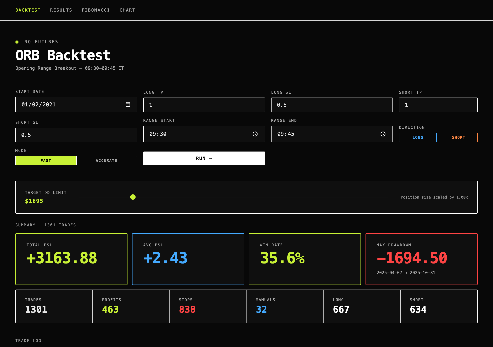

# NQ Backtester

Backtests intraday strategies on Nasdaq-100 E-mini futures (NQ) over five years of 1-second data. Each backtest runs as a single DuckDB query behind a FastAPI endpoint. A React frontend shows the trades, P&L, win rate and max drawdown.



## Features

- **ORB Backtest**: Opening Range Breakout with a configurable range and separate take-profit and stop-loss levels for longs and shorts. A fast mode scans 1-minute bars, and an accurate mode scans 1-second bars.
- **Results**: 5,202 precomputed take-profit/stop-loss/direction combinations, ranked by P&L scaled to a target drawdown.
- **Fibonacci**: retracement entries off the overnight range.
- **Chart**: candlesticks for any time range, from 1-minute to 1-day bars.

**Stack:** Python 3.11, FastAPI, DuckDB, Databento, React 19, TypeScript, Vite

## Data

The data is 67.7M 1-second bars from Feb 2021 to Feb 2026 (about 1,300 trading days), plus 2.6M 1-minute bars. It lives in a 4.6 GB DuckDB file that isn't committed. `data/api_seconds.py` pulls the bars from Databento (`GLBX.MDP3`, `ohlcv-1s`) and loads them into it. That's the only script that needs `API_KEY`.

## Running locally

Create `.env` in the repo root:

```
DB_PATH=/absolute/path/to/nq.db
API_KEY=your-databento-key
```

Backend on port 8000:

```bash
python3.11 -m venv venv && source venv/bin/activate
pip install -r requirements.txt
cd api && uvicorn main:app --reload --port 8000
```

Frontend on port 5173:

```bash
cd frontend && npm install && npm run dev
```
